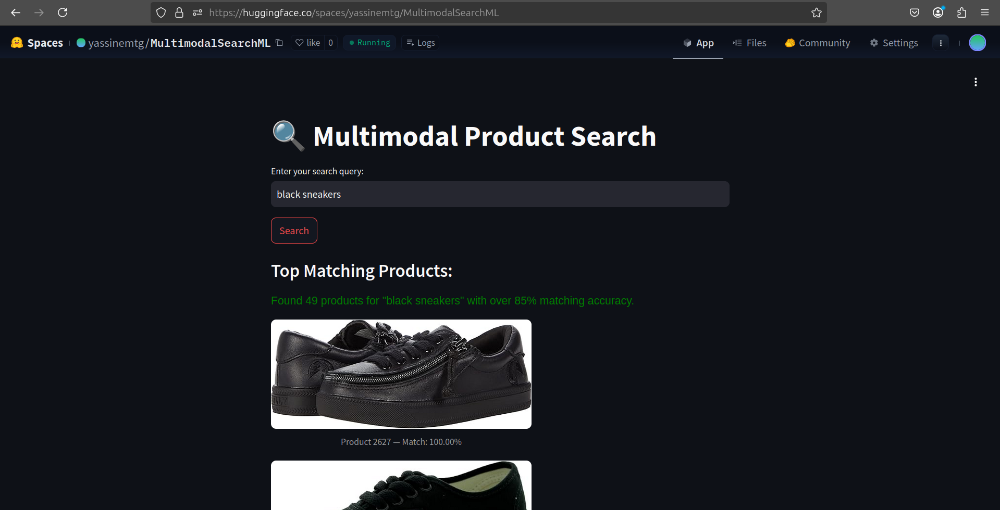

# Multimodal Search ML  

---

# Milestone 2 – Proof of Concept (PoC)

This milestone implements a functional prototype of the multimodal product search engine using OpenAI's CLIP model. The system supports natural language queries and returns visually and semantically relevant product images.

---

## Objectives

- Build an interactive UI to test query-to-image search
- Use real product data from the SQID dataset
- Deploy the app publicly on Hugging Face Spaces

---

## Model & Embedding

- **Model**: CLIP (`ViT-L/14`) from OpenAI
- **Embedding**:
  - Product image features: precomputed and stored in `products_sample.csv`
  - Query text: encoded in real-time using CLIP

---

## Dataset

- Source: [SQID (Shopping Queries Image Dataset)](https://github.com/Crossing-Minds/shopping-queries-image-dataset)
- Sample size: 15,000 products
- Format:
  - `product_id`
  - `product_title`
  - `image_url`
  - `clip_image_features` (768-dim)

---

## 💻 PoC UI Overview

- Built with **Streamlit**
- Accepts a free-text user query
- Encodes the query with CLIP
- Computes cosine similarity between query and all image embeddings (batched)
- Ranks top 10 matches and displays:
  - Product image
  - Title / ID
  - Normalized match score (%)

---

## Deployment

The working PoC is live on Hugging Face Spaces:

[View Demo](https://huggingface.co/spaces/yassinemtg/MultimodalSearchML)

---

## End-to-End Validation

| Component           | Status |
|---------------------|--------|
| Query input         | ✅     |
| CLIP query encoding | ✅     |
| Embedding similarity| ✅     |
| Image ranking       | ✅     |
| Visual output       | ✅     |

### Test Case

---

