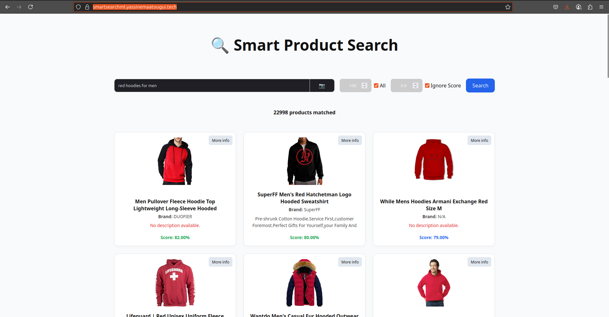

# Multimodal Search ML

---

# Milestone 5 (Model Deployment and Serving)

## Overview

The goal of this milestone is to productionize the MultimodalSearchML system built in earlier milestones. The system allows users to search for relevant products based on natural language queries using CLIP-based multimodal embeddings. Rather than training a new model, the system leverages a pretrained CLIP model (ViT-B/32) to encode both product information and user queries, and serves predictions via a FastAPI backend and a React-based frontend.

The entire system is modular, automated, and integrates tools like TFX, Feast, and DVC to handle data processing, feature storage, and versioning.

---

## ML System Architecture

The following architecture diagram shows the full machine learning system, including all tools and services involved in the pipeline and serving infrastructure:


### Component Descriptions :

- **CSV / Parquet Files**: Raw query and product data in tabular format. These files contain embeddings, metadata, and product image links.

- **DVC (Data Version Control)**: Tracks versions of input data and metadata. Connected to Google Drive for remote storage.

- **Google Drive**: Remote DVC storage used to store raw data files for reproducibility and sharing.

- **Redis**: Serves as the online feature store for fast retrieval of product embeddings.

- **TFX (TensorFlow Extended)**: Used for building the end-to-end ML pipeline: ingestion, validation, transformation, trainer, and pusher. It outputs the final model to be deployed.

- **MLflow**: Handles model tracking, experiment logging, and metric visualization. Integrated inside the TFX trainer.

- **GitHub**: Hosts the source code and CI/CD pipeline.

- **GitHub Actions**: Automates the deployment of the backend and frontend to Hugging Face and cPanel respectively.

- **FastAPI**: Lightweight Python API framework used to serve predictions and expose endpoints.

- **CLIP (ViT-B/32)**: Pretrained model used for encoding queries and product metadata into embeddings.

- **Gemini LLM**: Used for query rewriting to enhance semantic understanding before matching.

- **Docker**: Containers are used to package the FastAPI service for deployment.

- **Hugging Face Spaces**: Hosts the Dockerized FastAPI backend.

- **ReactJS**: Frontend application that users interact with.

- **cPanel**: Used to host the React frontend publicly.

Each arrow in the diagram illustrates data or control flow — from dataset versioning to real-time inference served on Hugging Face and visualized in the React app.

---

## Model Serving Mode

In this system, we implemented two serving modes:

🔹 1. On-Demand Serving to Humans (via UI)

    A React.js frontend lets users submit:

        Text queries

        Image uploads

    These are served to the backend for inference, and matching products are returned instantly.

🔹 2. On-Demand Serving to Machines (via API)

    A FastAPI backend exposes two main endpoints:

        POST /predict for text queries

        POST /predict-image for image-based search

    The backend is accessible as a public API hosted on Hugging Face Spaces.

    Can be queried programmatically using tools like curl or axios.

🔧 Deployment Setup

    The FastAPI backend is containerized using Docker.

    The API is deployed on Hugging Face via Dockerfile and .huggingface.yml.

    The frontend is deployed separately on a cloud server (cPanel).

---

## Model Service Development

The model service was designed to serve on-demand, low-latency predictions based on multimodal embeddings from the CLIP model. Instead of training a new model, we use the pretrained ViT-B/32 CLIP model to encode queries and products. This design ensures a consistent, production-ready service for image–text matching tasks.

### Backend Implementation (FastAPI)

- **Framework**: The FastAPI framework was chosen for its speed, simplicity, and OpenAPI integration.

- **Endpoints**:

    - POST /predict: Accepts a query string and returns the top-k matching products using cosine similarity over embeddings.

    - POST /predict-image: Accepts an image upload, embeds it via CLIP, and returns ranked product matches.

- **LLM Rewriter**: The backend optionally integrates Gemini LLM to rewrite natural language queries before encoding to improve semantic matching.

- **Redis**: Used for temporary embedding caching and fast retrieval operations.

- **DVC + Google Drive**: Data access and versioning are managed through DVC, with remote storage pointing to Google Drive.

### CLIP Model Integration

- **Model**: ViT-B/32, loaded via the clip Python package.

- **Usage**:

    - Both product descriptions and queries/images are encoded using CLIP.

    - Embeddings are precomputed and compared using cosine similarity.

### Model Packaging

- The full backend is containerized using Docker and deployed on Hugging Face Spaces.

- The Docker image includes:

    - All Python dependencies via requirements.lock

    - FastAPI app in app/main.py

    - CLIP model loading and pre/post-processing utils

- The container is automatically built and redeployed via GitHub Actions CI/CD on every push.

---

## Model Serving Runtime

The deployed MultimodalSearchML system leverages cloud infrastructure to serve predictions in real-time:

### Backend Runtime Environment

- **Hosting Platform**: Hugging Face Spaces

- **Serving Framework**: FastAPI with automatic OpenAPI docs

- **Containerization**: Docker is used to isolate and run the backend service

### Runtime Setup

- The service is launched using a custom Dockerfile and requirements.txt.

- The runtime environment pulls the latest code and models from GitHub on each deploy.

- On every new push to main, GitHub Actions triggers automatic container rebuild and deployment.

### Performance Features

- Low-latency serving with Redis caching for embeddings

- On-the-fly embedding using CLIP for both image and text

- LLM-based query rewriting to improve semantic accuracy before matching

This setup enables both human (React UI) and machine (public API) clients to interact with the model in a scalable and production-ready runtime environment.

---

## Front-End Client Development

The front-end application provides an interactive user interface that allows users to perform multimodal search through both text and image inputs. It was built using ReactJS with modern best practices in component-based architecture and state management.

### Core Features

- **Text-based Search**: Users can input natural language queries describing the product they are looking for. The input is processed and sent to the FastAPI backend for similarity-based retrieval using CLIP embeddings.

- **Image-based Search**: Users can upload an image to find visually similar products. The image is embedded using the CLIP model and matched against product embeddings.

- **Result Display**: Retrieved products are displayed as responsive cards containing:

    Product title

    Thumbnail image

    Relevance score (cosine similarity)

    “More Info” button for detailed view

- **Search Customization Controls**: The UI includes toggles for setting:

    top_k (number of results)

    threshold (minimum similarity score)

    Whether to allow text/image input independently

- **Navigation and Routing**: Implemented using **react-router-dom**, allowing clean navigation between the search results page and the product detail page.

### Tech Stack

| Technology           | Purpose                                  |
| -------------------- | ---------------------------------------- |
| **ReactJS**          | Front-end framework                      |
| **Axios**            | API requests to FastAPI                  |
| **React Router DOM** | Client-side routing                      |
| **Tailwind CSS**     | Styling and responsive layout            |
| **React Icons**      | Icons for UI feedback                    |
| **State Hooks**      | Search input and result state management |

### Hosting

The frontend is hosted via cPanel, deployed manually through file upload and auto-refresh. The final UI is fully responsive and publicly accessible [Here](https://smartsearchml.yassinemaatougui.tech/)

The backend is hosted via Hugging Face spaces. It is accessible [Here](https://huggingface.co/spaces/yassinemtg/smartsearch-api)

- Screenshot Example



---

## Packaging and Containerization

To ensure portability, reproducibility, and isolation of the backend inference service, the FastAPI server was packaged into a Docker container.

### Dockerization Workflow

1. Dockerfile

A custom Dockerfile was written to:

- Set up a minimal Python environment using an official python:3.10-slim base image

- Install all dependencies from a pinned requirements.txt

- Copy the application codebase into the container

- Set the working directory and expose the serving port

- Launch the FastAPI server using uvicorn

Key Dockerfile commands:

```bash
FROM python:3.10-slim
COPY requirements.txt .
RUN pip install -r requirements.txt
COPY app /app
WORKDIR /app
CMD ["uvicorn", "main:app", "--host", "0.0.0.0", "--port", "7860"]
```

2. .dockerignore

Unnecessary files such as local datasets, **.git**, and cache directories are excluded from the container image build context.

3. Testing Locally

The Docker image was tested using:

```bash
docker build -t multimodal-backend .
docker run -p 7860:7860 multimodal-backend
```

The API was successfully served on http://localhost:7860.

### Benefits of Containerization

- Ensures consistent runtime environment across development, testing, and deployment

- Makes backend easily deployable to cloud platforms like Hugging Face or DigitalOcean

- Reduces environment conflicts and simplifies dependency management

---

## CI/CD Integration and Deployment

The MultimodalSearchML project supports continuous integration and deployment (CI/CD) to streamline the release of updates to both the backend and frontend services.

### CI/CD for Backend (FastAPI)

- **Platform**: GitHub Actions

- **Target**: Hugging Face Spaces

Every push to the main branch automatically triggers the backend deployment pipeline via a .github/workflows/deploy.yml file.

**Key Steps in CI/CD Workflow:**

1. Checkout repository

2. Set up Python environment

3. Install dependencies from requirements.txt

4. Build and push Docker container

5. Trigger Hugging Face deployment using .huggingface.yml

**Hugging Face Integration:**

```yaml
# .huggingface.yml
title: MultimodalSearchML
sdk: docker
emoji: 🔍
```

This automation ensures that any committed changes to the main branch result in a refreshed, containerized FastAPI app being redeployed live on Hugging Face Spaces.

---

### Deployment of Frontend (React)

The React frontend was deployed manually via cPanel:

- The build output from npm run build was uploaded to the public_html folder on the hosting server.

- The interface is now publicly available via your domain (insert link if available).

- Any frontend update is handled by rebuilding locally and replacing the previous build on the server.

### Authentication & Security Notes

- Environment secrets should be defined in GitHub repository settings under Settings > Secrets and variables.

- Hugging Face deployment uses a personal access token (HF_TOKEN) securely stored in the repo secrets.
