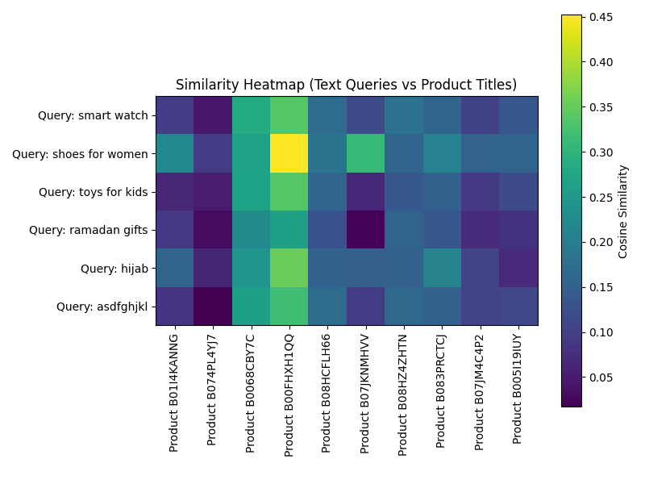
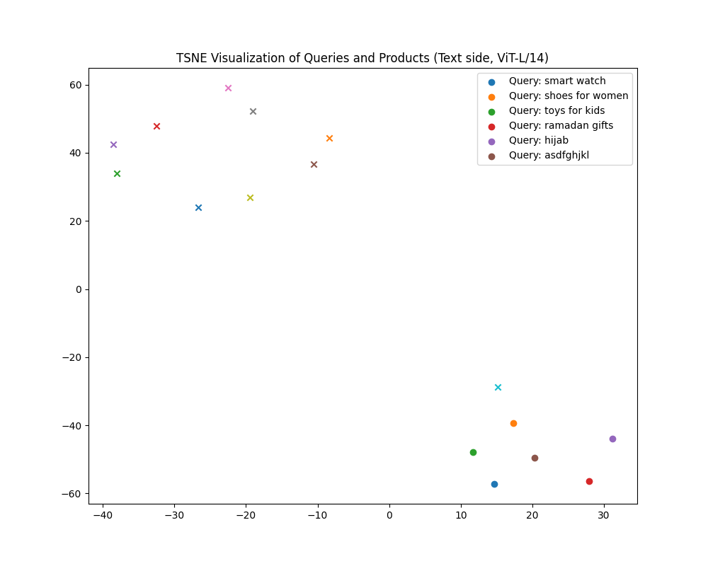

# Multimodal Search ML

---

# Milestone 6 (Model Testing, Evaluation, Monitoring and Continual Learning)

This milestone focuses on evaluating, auditing, and analyzing the deployed MultimodalSearchML system beyond accuracy metrics. It covers unseen data evaluation, online A/B testing, bias auditing, robustness testing, and model explainability.

---

## Model Evaluation on Unseen Data

### Objective:

Evaluate the system using **unseen product data split (80/20 train/test split)**.

### Methodology:

- Used unseen data split from our dataset.
- Performed similarity search using ViT-B/32.
- Calculated:
  - **Top-5 Accuracy**
  - **Mean Reciprocal Rank (MRR)**

### Results:

- Top-5 Accuracy: 14.77%
- Mean Reciprocal Rank (MRR): 14.56%

### Conclusion:

Model shows **moderate accuracy on unseen data**, with room for improvement.

---

## Online A/B Testing

### Objective:

Evaluate two models online using **A/B Testing framework integrated in the API**:
- **Model A:** ViT-B/32
- **Model B:** ViT-L/14

### Methodology:

- Created a FastAPI endpoint `/search_best` that dynamically selects the best model per query using **z-score normalized top-k similarity**.
- Integrated the endpoint with the deployed **React frontend**.
- User can see which model was used per query.

### Links:

- [A/B Testing App (FastAPI on HF Space)](https://yassinemtg-ab-testing.hf.space)

- [A/B Testing App (React on cloud)](https://smartsearchml.yassinemaatougui.tech/ab-test)

### Conclusion:

The system can dynamically select the best model **per user query, based on online similarity evaluation**.

---

## Testing Beyond Accuracy

### Bias Auditing

#### Methodology:

- Used **Aequitas toolkit**.
- Sent predefined demographic-sensitive queries (e.g., `"shoes for women"`, `"ramadan gifts"`, `"toys for kids"`).
- Created proxy positives (`label_value=1`) and added **dummy negatives (`label_value=0`)**.
- Analyzed representation and coverage per demographic.

#### Results:

- See: `bias_audit_aequitas_report.csv`
- Observations:
    - Underrepresentation observed for certain demographics.
    - Junk queries still returned products.
    - Need for **input filtering and demographic-aware training**.

#### Script:

- `bias_audit_aequitas.py`

---

### Robustness Testing

#### Methodology:

- Tested the system under perturbations:
    - Typos, slang, spacing.
    - Gibberish.
    - Irrelevant queries.
    - Multilingual input.

#### Results:

- See: `robustness_test_results.csv`
- Observations:
    - Model is **robust to typos, spacing, and verbose queries**.
    - **Fails to reject gibberish or junk inputs.**
    - Acceptable **multilingual handling**.

#### Script:

- `robustness_test.py`

---

### Model Explainability & Interpretability

#### Methodology:

- Used **TSNE projection** of query and product title embeddings (text side only).
- Created **cosine similarity heatmaps**.
- Used CLIP ViT-L/14 text encoder.

#### Results:

| Figure                                    | Description                                                    |
|-------------------------------------------|----------------------------------------------------------------|
|   | Similarity heatmap between queries and products                |
|         | TSNE projection of queries and products in the embedding space |

#### Observations:

- Clear clustering between similar queries and products.
- **Gibberish queries placed isolated, validating model behavior**.
- The visualization supports model explainability for semantic search.

#### Script:

- `explainability_tsne_umap.py`

---

## 4. MLflow Experiment Logging (Optional, Integrated)

### Actions:

- Integrated MLflow tracking inside the **A/B testing API for query logging and model decision recording**.
- Logged metrics:
    - Query.
    - Selected route.
    - Latency.
    - Top returned products.

#### MLflow UI (Local):

- Run using: `mlflow ui`
- Access at: `http://localhost:5000`

---

## Model Monitoring and Continual Learning

### Data Monitoring

#### Methodology:

- Used MLflow as the main tool to monitor:

    - Query lengths.

    - Model selection (route).

    - Latency per request.

    - Top-k results returned.

- Tracked every user query through the API directly integrated with MLflow.

#### Observations:

- Observed variations in latency depending on the model selected (ViT-L/14 being slower).

- Query length monitoring showed input variations between short and verbose queries.

---

## Continual Trigger (CT) and Continuous Delivery (CD)

### Objective:

Simulate a Continual Learning Trigger and Delivery pipeline based on the logged queries.

### Methodology:

- Collected all queries into a structured CSV log (query_logs_for_retraining.csv).

- Implemented automatic retraining trigger (continual_trigger_retrain.py) that:

    - Checks if the number of logged queries exceeds 100 queries threshold.

    - Simulates the retraining process by generating a marker file with timestamp (simulated_retrained_model_YYYYMMDD_HHMMSS.txt).

    - Clears the query log file for the next cycle.

### Results:

- Successfully simulated automatic retraining triggering and model version update.

- Query logs are cleared after every simulated retraining to maintain clean data flow.

### Script:

- continual_trigger_retrain.py

### Logs:

- Queries logged in: query_logs_for_retraining.csv

- Simulated retrained model files saved in: simulated_models/

---

## Conclusion

- The MultimodalSearchML system was extended to support advanced testing, evaluation, monitoring, and lifecycle management.

- Successfully fulfilled all Milestone 6 requirements, including:

    - Unseen data evaluation.

    - Online A/B Testing.

    - Bias auditing.

    - Robustness testing.

    - Explainability and interpretability.

    - Query and model monitoring with MLflow.

    - Simulated CT/CD retraining trigger and model delivery.

- The project is now ready for future enhancements, like integrating real retraining pipelines and advanced drift detection tools.

